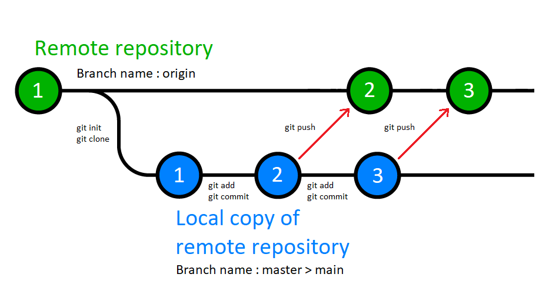

## Git basics


There are a number of tools which one can use to interact with Git or GitHub. Two of them
are the Git command line interface (git) and the GitHub command line interface (gh).

The git utility allows you to work with both local and remote Git repositories - including Git
repositories which are hosted on GitHub. The GitHub command line interface on the other hand,
is specifically for working with GitHub.

We will refer to both of these command line utilities - git and gh, here in this discussion.

For more information on the gh command line utility, have a look at the following;

[GitHub CLI quickstart](https://docs.github.com/en/github-cli/github-cli/quickstart)


#### + Get help for Git in general
```
  > git help
```


#### + Providing git with user information about yourself

Before you can issue certain commands from the git CLI, you might need to
provide it with some information about yourself. If you don't, then you may
be presented with the following message. 
```
Author identity unknown

*** Please tell me who you are.

Run

  git config --global user.email "you@example.com"
  git config --global user.name "Your Name"

to set your account's default identity.
Omit --global to set the identity only in this repository.

fatal: unable to auto-detect email address (got 'Craig@Wombat.(none)')

```


#### + Authenticating yourself to GitHub

Before you can perform certain interactions with the GitHub server, you will
first need to authenticate yourself to it. This can be done in a number of
different ways; one of which involves the use of https and another which
involves the use of ssh.

One way in which you can authenticate yourself to the GitHub server, is to
use the following command;
```
gh auth login
```
Two points need to be made about this command.

1) It will present you with a series of interactive questions which you
will need to use the keys on your keyboard to answer. As a consequence, the
terminal which you use to invoke this command will need to be able to
provide a decent level of functionality.

2) This command may require access to an ssh key. If you have an ssh key,
you might be able to find it in a location such as;
```
/home/foo/.ssh/
or
C:\Users\Foo\.ssh\
```


#### + Get help for a particular Git command
```
  > git <Name of command> -h
```
Example;
```
  > git commit -h
```


#### + Initialise a directory to hold a local copy of a repository
```
  > git init
```

This will create a hidden file called ```.git``` in the directory from which this command was invoked.
This hidden file contains the local version of the Git repository.

#### + Clone a remote repository into a local directory
```
  > git clone <URI of remote repository>
```
Example;
```
  > git clone https://github.com/c-sanders/Gtk4-Example-1.git
```
Note that this will create a sub-directory called ```Gtk4-Example-1``` within
the current working directory and then clone the contents of the remote
repository into this sub-directory.  


#### + Configure a local directory to be a copy of a GitHub repository
In order to do this, the sequence of steps below need to be followed. 
```
  > git init
  > git add README.md
  > git commit -m "Commit comment."
  > git branch -M main
  > git remote add origin https://github.com/c-sanders/GitHub-Repository.git
  > git push -u origin main
```

Note : After the ```git init``` command has been executed as part of the above sequence, git will
display the following message;

```
hint: Using 'master' as the name for the initial branch. This default branch name
hint: is subject to change. To configure the initial branch name to use in all
hint: of your new repositories, which will suppress this warning, call:
hint:
hint:   git config --global init.defaultBranch <name>
hint:
hint: Names commonly chosen instead of 'master' are 'main', 'trunk' and
hint: 'development'. The just-created branch can be renamed via this command:
hint:
hint:   git branch -m <name>
Initialized empty Git repository in C:/Users/foo/GitHub/Gtk4-Example-1/.git/
```

#### + Dealing with branches

The ```git branch``` command was mentioned in the previous section. This command is used to perform various
operations on branches such as creating, listing, renaming, and deleting branches. This command doesn't let
you switch between branches or put a forked history back together again. For this reason, git branch is
tightly integrated with the git checkout and git merge commands.

The output from the ```git branch -h``` command looks as follows;

```
usage: git branch [<options>] [-r | -a] [--merged] [--no-merged]
   or: git branch [<options>] [-l] [-f] <branch-name> [<start-point>]
   or: git branch [<options>] [-r] (-d | -D) <branch-name>...
   or: git branch [<options>] (-m | -M) [<old-branch>] <new-branch>
   or: git branch [<options>] (-c | -C) [<old-branch>] <new-branch>
   or: git branch [<options>] [-r | -a] [--points-at]
   or: git branch [<options>] [-r | -a] [--format]

Generic options
    -v, --verbose         show hash and subject, give twice for upstream branch
    -q, --quiet           suppress informational messages
    -t, --track           set up tracking mode (see git-pull(1))
    -u, --set-upstream-to <upstream>
                          change the upstream info
    --unset-upstream      unset the upstream info
    --color[=<when>]      use colored output
    -r, --remotes         act on remote-tracking branches
    --contains <commit>   print only branches that contain the commit
    --no-contains <commit>
                          print only branches that don't contain the commit
    --abbrev[=<n>]        use <n> digits to display object names

Specific git-branch actions:
    -a, --all             list both remote-tracking and local branches
    -d, --delete          delete fully merged branch
    -D                    delete branch (even if not merged)
    -m, --move            move/rename a branch and its reflog
    -M                    move/rename a branch, even if target exists
    -c, --copy            copy a branch and its reflog
    -C                    copy a branch, even if target exists
    -l, --list            list branch names
    --show-current        show current branch name
    --create-reflog       create the branch's reflog
    --edit-description    edit the description for the branch
    -f, --force           force creation, move/rename, deletion
    --merged <commit>     print only branches that are merged
    --no-merged <commit>  print only branches that are not merged
    --column[=<style>]    list branches in columns
    --sort <key>          field name to sort on
    --points-at <object>  print only branches of the object
    -i, --ignore-case     sorting and filtering are case insensitive
    --format <format>     format to use for the output
```

#### + Failing to set an upstream branch

If for whatever reason, you fail to set an upstream branch for your
local directory, git will warn you about this fact and display the following message;

```
fatal: The current branch master has no upstream branch.
To push the current branch and set the remote as upstream, use

    git push --set-upstream origin master
```

Consider the following image.



As you can see from the image, the green path represents the remote repository, while the blue path represents
the local copy of this remote repository. The remote repository could very well be a repository which is hosted
on GitHub. 

#### + Check the status of a local repository
```
  > git status
```

#### + Add a local file to a local repository
```
  > git add <Name of file>
```
Example;
```
  > git add Filename.cpp
```

#### + Remove a file from a repository
```
  > git rm <Name of file>
```
Example;
```
  > git rm Filename.cpp
```

#### + Commit changes, i.e. additions and removals of files, to the local repository
Will this "stage" the changes, and make them ready and waiting to be pushed to
the remote repository?
```
  > git commit -m "Commit comment."
```

#### + Pushing locally committed changes to a remote repositoy
```
  > git push
```
or
```
  > git push origin master
```